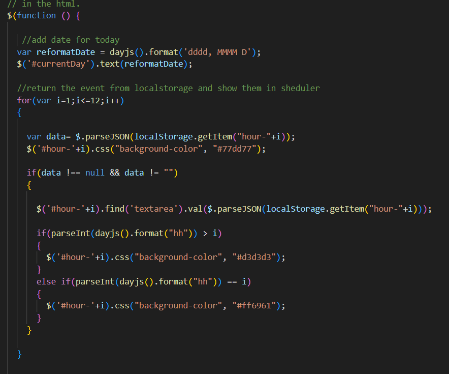
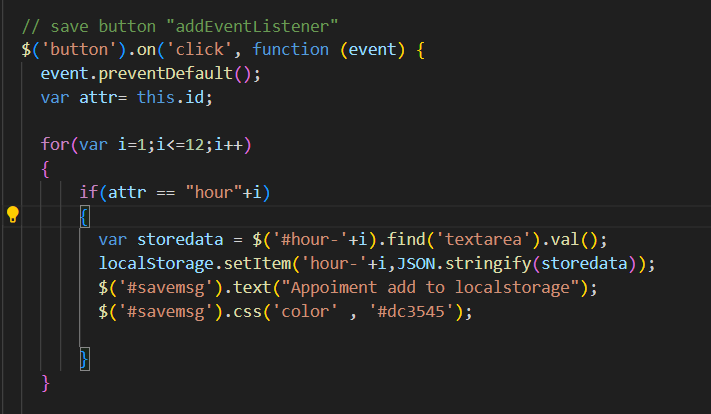
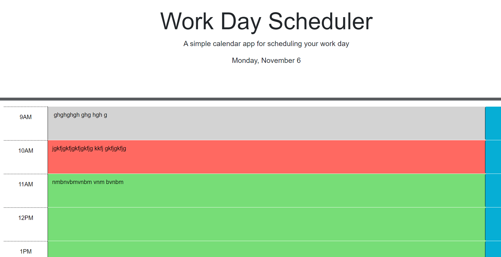
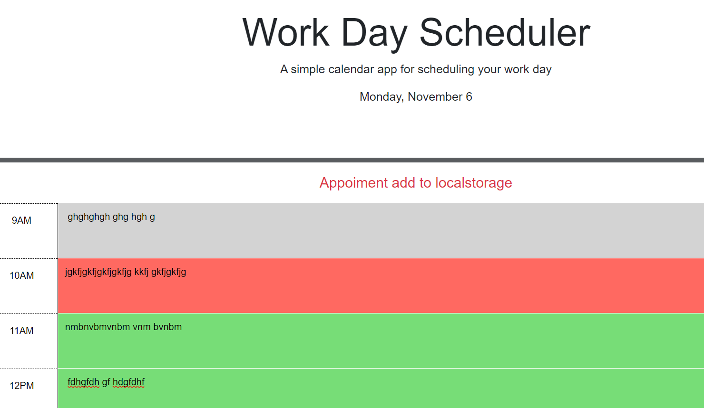

# work-day-Scheduler

## Description

- What was your motivation? I learn alot about Web-APIs , third-party-APIs and jquery for javascript 
- Why did you build this project? I build this project to make schedular for work and can help employee ,students or personal used.
1- I add a day time for work day scheduler
2- when click save button can save the event at the current time location and message show for data save 
3- add line between the header and body
4- events color change , present , current and past.
5- used localstorge to save event information 
- What did you learn? I learn web-APIs, third-party-APIs and jquery for javascript and how to used the time and date.

## Installation

N/A

## Usage
when open the webpage, it will show the work day scheduler and the date then under it , you will see the time from 9AM to 5PM, every hour has save button and area to add commit for the event, when click save it will save it.
there are some colors in the event status, green color means no event , gray color means the event was due and red color means has event setup.

https://omeraus6.github.io/work-day-Scheduler/
deploy link

https://github.com/omeraus6/work-day-Scheduler
github link

image 1: 

image 2: the first 2 image are the code

image 3:  the webpage show the Date and the event color , current ,past and future

image 4: show the save message 

## Credits

Thank you for tips and sugestion from Bootcamp instructors and classmates, I hava used https://www.w3schools.com/ , https://stackoverflow.com/ and https://developer.mozilla.org/en-US/docs/Web/CSS/grid-template to reserch information 

## License

Please refer to the LICENSE in the repo.